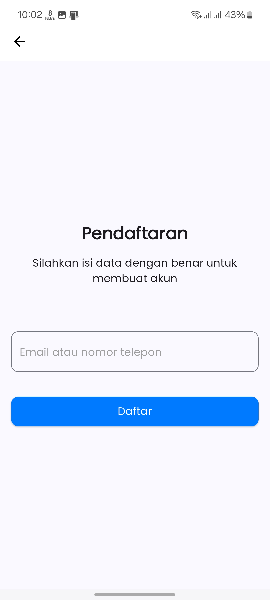
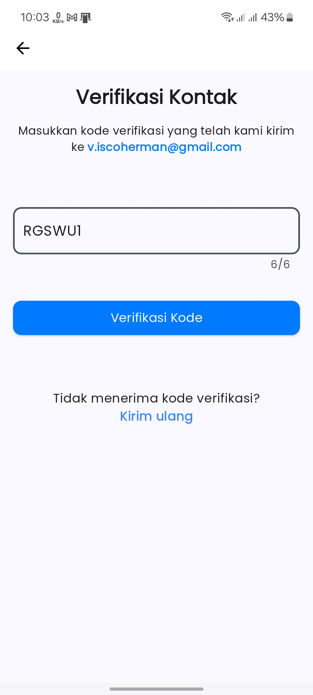
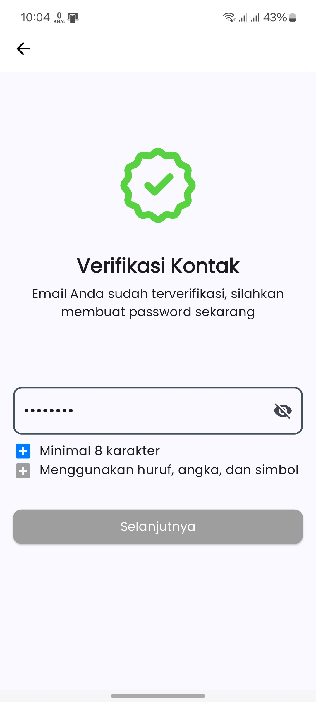
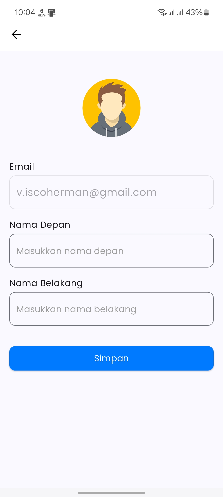
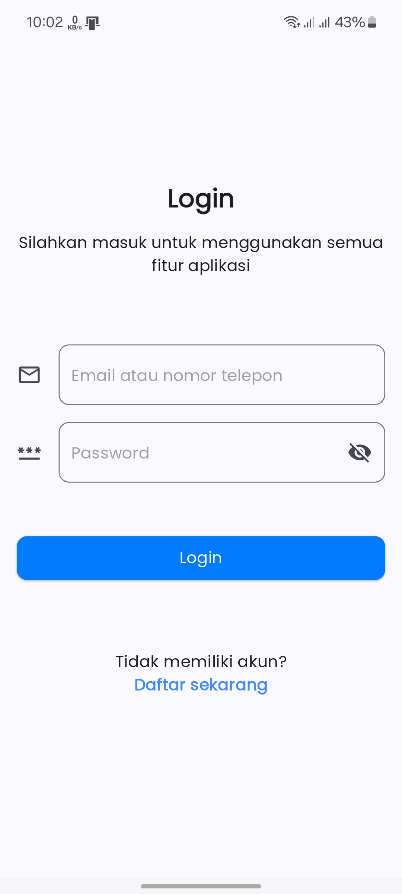
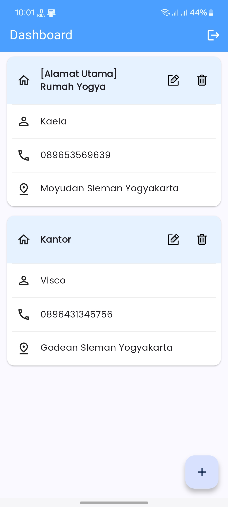
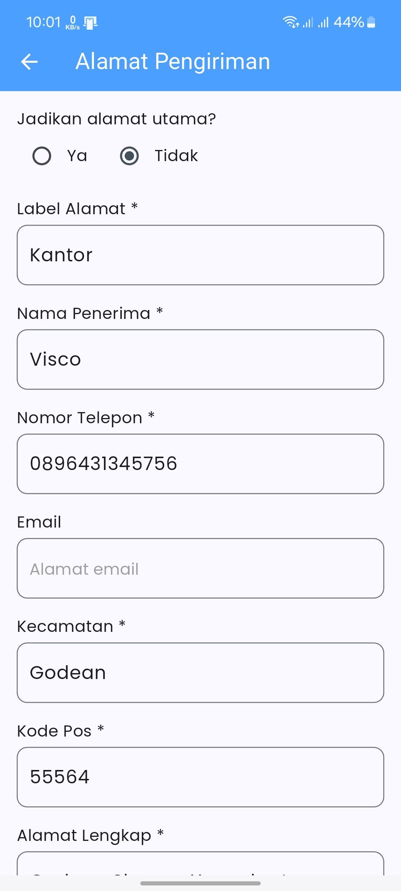
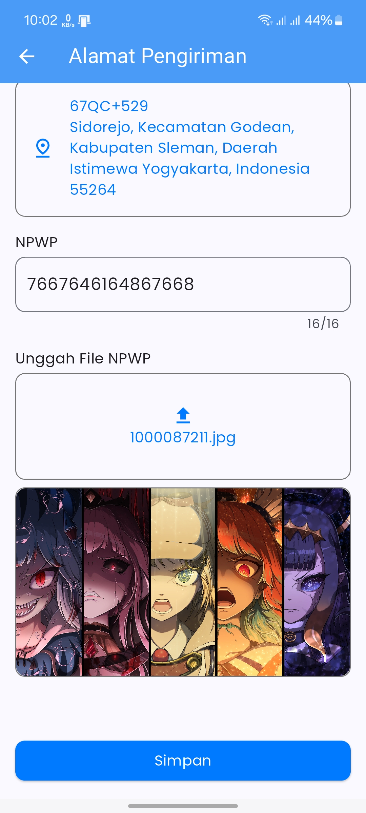
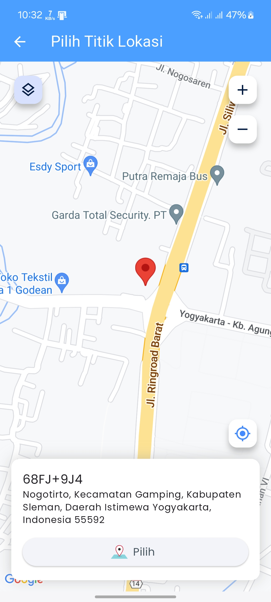
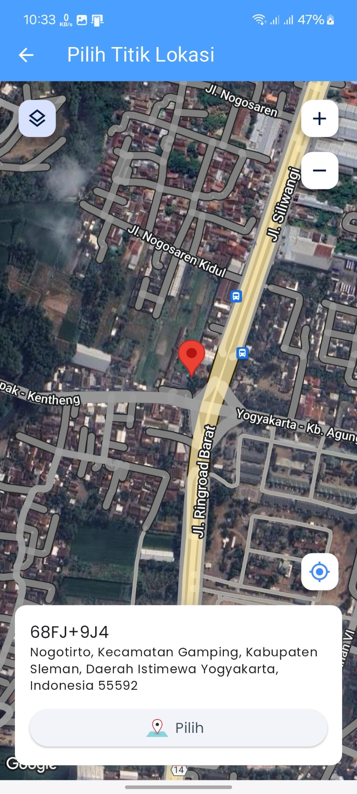

Skill test Mobile Developer

## Tech
- Provider - State Management
- Get It - Dependency Injection
- Chopper - REST Client
- Shared Preference
- Google Map API

## TODO
Ganti nilai variable di bawah ini dengan API KEY yang dimiliki
- **GOOGLE_MAP_API_KEY** di AndroidManifest.xml
- **API_ACCESS_TOKEN** di header_interceptor.dart

## Screenshots
<table>
  <tr>
    <td></td>
    <td></td>
    <td></td>
    <td></td>
  </tr>
  <tr>
    <td></td>
    <td></td>
    <td></td>
    <td></td>
  </tr>
  <tr>
    <td></td>
    <td></td>
  </tr>
</table>
